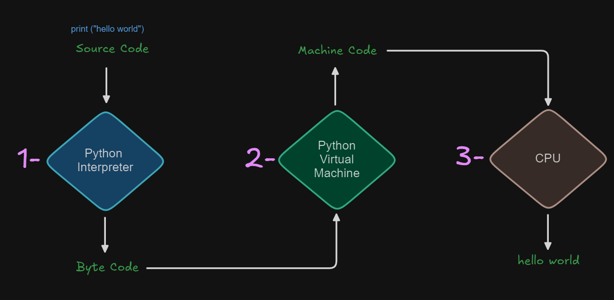

# 1. Introduction to Python

Python is an open-source, general-purpose, high-level, interpreted, object-oriented, dynamic programming language.

## 1.1 Where we use Python?

[Python Applications](https://wiki.python.org/moin/Applications)

- Web and Internet development (e.g., Django and Pyramid frameworks, Flask and Bottle micro-frameworks).
- Scientific and numeric computing (e.g., SciPy - a collection of packages for the purposes of mathematics, science, and engineering
- Ipython - an interactive shell that features editing and recording of work sessions).
- Desktop GUIs (e.g., wxWidgets, Kivy, Qt)
- Software Development (build control, management, and testing - Scons, Buildbot, Apache Gump, Roundup, Trac)

* Business applications (ERP and e-commerce systems - Odoo, Tryton)
  (Source: https://www.python.org/about/apps)\*

## 1.2 What is Machine Language

Machine language is the language understood by a computer. It is very difficult to understand, but it is the only thing that the computer can work with. All programs and programming languages eventually generate or run programs in machine language. Machine language is made up of instructions and data that are all binary numbers. Machine language is normally displayed in hexadecimal form so that it is a little bit easier to read. Assembly language is almost the same as machine language, except that the instructions, variables and addresses have names instead of just hex numbers.

_Source: [MICHAEL L. SCHMIT, in Pentium™ Processor, 1995](https://www.sciencedirect.com/topics/engineering/machine-language#:~:text=Machine%20language%20is%20made%20up,little%20bit%20easier%20to%20read.)_

## 1.3 Python, a high-level programming language

- Computer (machine) understands only one language i.e. Machine Language.
- Machine Language is not humand readable (0s and 1s)
- A language either natural or programming has

  - alphabets: a, b, c, d, e.
  - lexis: dictionary.
  - syntax: rules (like grammar in english).
  - semantics: should make sense.

- A language that is simple and easy to understand.
- A language simpler than natural language.
- More complex than Machine Language.
- A program (set of instructions) written in high-level language is called a **source code**.
- The file containing that code is called a **source file**

## 1.4 How computer will understand python?

Computer doesn't know any language other than machine language. How we can make it understand a high-level language?
We translate the source code written in high-level language into machine language.

There are two main ways to convert a program from a high-level language to machine language:

1. **Compilation**: The source code is translated into machine code once, producing a file (e.g., an .exe file for Windows). This process needs to be repeated if you modify the source code. Once compiled, you can distribute the machine code file globally. The tool that does this translation is called a compiler.

2. **Interpretation**: The source code is translated into machine code every time it is run. The tool that performs this task is called an interpreter. This means you need to provide the source code and the interpreter to the end-user since the code is interpreted each time it is executed.



## 1.5 Setting up Coding Environment

1. **Python Installation**: [Download](https://www.python.org/downloads/) and install Python.
2. [Download](https://code.visualstudio.com/download) and install Visual Studio Code (an IDE).

# 2. Data Types in Python

## 2.1 Primitive Data Types

Primitive Types are the kind of data that can be stored in computer's memory. In Python, primitive types are the most basic data types that are built into the language.

- String -> `str`
- Integer -> `int`
- Float -> `float`
- Complex -> `complex`
- Boolean -> `bool`
- None -> `None`

```python
# Integer
integer_value = 42
print("Integer:", integer_value)

# Float
float_value = 3.14
print("Float:", float_value)

# Complex
complex_value = 1 + 2j
print("Complex:", complex_value)

# String
string_value = "Hello, World!"
print("String:", string_value)

# Boolean
boolean_true = True
boolean_false = False
print("Boolean True:", boolean_true)
print("Boolean False:", boolean_false)
 **None Type**
How to use the None keyword to define a null value in Python. None is a data type of its own and not the same as 0, False, or an empty string.
Using None in Python

None is often used as a default value for function arguments or to indicate that a variable has not been set to any particular value. It can also be used to represent the absence of a return value in a function, as functions in Python implicitly return None if no return statement is executed.

Here's an example of assigning None to a variable and checking if it is None:

x = None
if x is None:
print("x is None")
else:
print("x has a value")
Copy
Comparing with None

When checking if a variable is None, it is recommended to use the identity operators is and is not rather than the equality operators == and !=. This is because is checks for identity, meaning it checks whether two variables point to the same object in memory, which is the case for None since it is a singleton.

Here's an example of using is to check for None:

x = None
if x is None:
print("x is indeed None")
Copy
None as a Default Parameter

Using None as a default parameter in functions is a common practice in Python. This is particularly useful when the argument could be a mutable data type, such as a list or a dictionary. By using None, you can avoid the common pitfall of using mutable default arguments.

Example of using None as a default parameter:

def append_to_element(element, target_list=None):
if target_list is None:
target_list = []
target_list.append(element)
return target_list
Copy
None in Conditional Statements

Since None is considered falsy in Python, it can be used in conditional statements to check if a variable has a non-falsy value.

Example of using None in a conditional statement:

result = None
if not result:
print("The result is None or falsy")
Copy
Conclusion

None is a unique and important part of Python that allows for a clear representation of the absence of a value. It is a versatile tool that can be used in various situations, such as default parameters, return values, and conditional checks. Understanding how to use None effectively is crucial for writing clean and maintainable Python code
# NoneType
none_value = None
print("NoneType:", none_value)
```

### 2.1.1 Python Literals

A literal is data whose values are determined by the literal itself.
In Python, literals are notations for constant values of a particular type. They represent fixed values in the code. Python supports several types of literals, including numeric, string, boolean, and special literals.

```python
# Numeric Literals
integer_literal = 42
float_literal = 3.14
complex_literal = 1 + 2j

# String Literals
single_quote_string = 'Hello'
double_quote_string = "World"
triple_quote_string = '''This is a
multi-line string'''

# Boolean Literals
true_literal = True
false_literal = False

# Special Literal
none_literal = None

# Printing the literals
print("Integer Literal:", integer_literal)
print("Float Literal:", float_literal)
print("Complex Literal:", complex_literal)
print("Single Quote String:", single_quote_string)
print("Double Quote String:", double_quote_string)
print("Triple Quote String:", triple_quote_string)
print("Boolean Literal True:", true_literal)
print("Boolean Literal False:", false_literal)
print("Special Literal None:", none_literal)
```

## 2.2. Collection Data Types in Python

### 2.2.1 List

An ordered, mutable collection of items.

```python
names_list: list[str] = ["Rehan", "Musa", "Abdullah"]
numbered_list: list[int] = [1, 2, 3, 4, 5]
mixed_list: list[int | str | float | bool] = [1, "Rehan", 3.14, True]
```

### 2.2.2 Tuple

An ordered, immutable collection of items.

```python
names_tuple: tuple[str] = ("Rehan", "Musa", "Abdullah")
numbered_tuple: tuple[int] = (1, 2, 3, 4, 5)
mixed_tuple: tuple[int | str | float | bool] = (1, "Rehan", 3.14, True)
```

### 2.2.3 Set

An unordered collection of unique items.

```python
names_set: set[str] = {"Rehan", "Musa", "Abdullah"}
numbered_set: set[int] = {1, 2, 3, 4, 5}
mixed_set: set[int | str | float | bool] = {1, "Rehan", 3.14, True}
```

### 2.2.4 Dictionary

An unordered collection of key-value pairs.

```python
names_dict: dict[str, str|int] = {"name": "Rehan", "age": "22"}
numbered_dict: dict[int, str] = {1: "Rehan", 2: "Musa", 3: "Abdullah"}
```

### 2.3. Specialized Data Types

#### 2.3.1 Range

Represents an immutable sequence of numbers.

```python
range_object: range = range(1, 10)
```

#### 2.3.2 Bytes

```python
byte_string: bytes = b"Hello, World!"
```

- Bytes
- Bytearray
- Frozen set
- Generator
- Ellipsis
- Class
- Type
- Ellipsis
